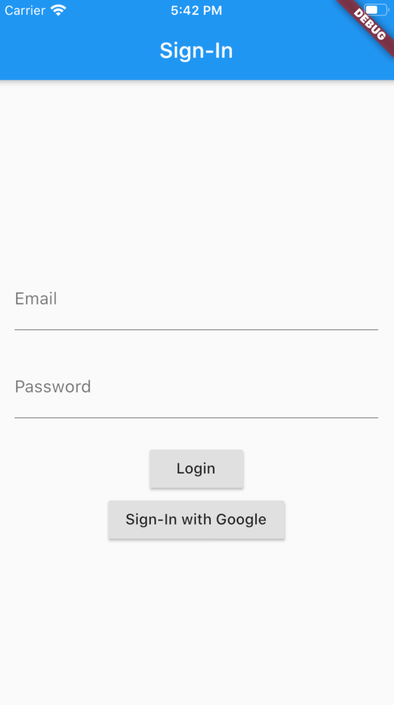

# Polygottal - Dart

This is a Code Chrysalis assignment to learn a new programming language.

## Project Summary

### Application Features

This is a mobile application that you can vote and discuss programming languages.

#### Login



At first, you need to login by email and password. When succeeded, view transits to vote view.
Email and password are validated on the client side.
Identity pool and authenticator is Firebase Auth.

#### Vote


You can vote your favoite languages here.
And you can also add a new language and see the winner from buttons on navigation area.


You can join the chat room for each language, and start chat.

### Tech Stack


## Why Dart?

Here are the languages I've written more than one line of code in.

Because of my weak mobile development experience, I chose Dart, which is available in Flutter. (I ruled out React Native this time because I can't use JavaScript/TypeScript.)

- Assembly Language
- C
- C++
- Scala
- Typescript
- JavaScript
- Python
- Java
- Go
- C#
- Perl
- Objective-C
- OCaml
- DSL Lanuages(VDM++, Alloy, JCSP, Promela, etc)

## Check List

### Objectives

- Become a proficient independent language learner by learning a new computer language!

- Be able to draw comparisons between JavaScript (or other languages you know) and the new language

- Learn how to use a new language to create a project from scratch

### Questions to Ask

- [x] Is it already installed on your machine? If so, what version?

Not installed yet.

- [x] Are there multiple versions of the language? Which is best?

Dart1 and Dart2. Dart1 is killed by TypeScript, Dart2 came back to life with Flutter with new powerful language features, like typing.

- [x] Is there an online sandbox for your language? Try it out!

[DartPad](https://dartpad.dev/)

- [x] How to install it?

Mac: brew

- [x] What is its package manager?

pub, it is Dart official package manager

- [x] What IDEs are common?

VSCode, Android Studio, IntelliJ, and DartPad

- [x] What testing suite is most popular?

test: Dart official test library
mockito: Dart official mock library
flutter_driver: Flutter official test driver for Flutter Integration test.

- [x] Where does your package manager load dependencies from?

pub

- [x] What are the most popular frameworks?

mobile -> Flutter

server -> Server-side Dart

web -> AngularDart

- [x] Does your chosen language have a debugger?

Dart Debugger: console tool like gdb
Dart Dev Tools: rich debugger tool work as web application

- [x] Are there any recent interesting threads or posts on HackerNews about your language?

[Flutter and Dart, or how to quickly build a mobile app without losing your hair](https://news.ycombinator.com/item?id=22454115)

### Stage 0

- [x] Decide what your project will be.
- [x] Send 2-3 sentence summary to staff (on #assignment that includes what you plan to build and why it makes sense with the language you chose.

### Stage 1

Following [Dart official tutorial](https://dart.dev/tutorials/server/get-started):

- [x] Install the language

Mac

```
 brew tap dart-lang/dart
 brew install dart
```

- [x] Install the package manager

package manager: pub

installed when installing dart language

command is like this

```
pub global activate stagehand
```

We can use `stagehand` command to generate packages with valid pubspec.yaml files and directory structures.

```
stagehand console-simple
```

Then base dependency is automatically created.

```
name: cc13_polyglottal
description: A simple command-line application.
# version: 1.0.0
# homepage: https://www.example.com

environment:
  sdk: '>=2.8.1 <3.0.0'

#dependencies:
#  path: ^1.7.0

dev_dependencies:
  pedantic: ^1.9.0
```

- [x] Find the right IDE and install it

Dart official says [major IDEs are](https://dart.dev/tools):

- Android Studio
- VS Code -> I choose it.
- IntelliJ

and also, [DartPad](https://dartpad.dev/)

Install VS Code Extensions:

Dart

Flutter

- [x] Build and run “hello world”

Console(JIT on DartVM)

```
dart bin/cc13_polyglottal.dart
```

Console(AOT to native machine code)

```
dart2native bin/cc13_polyglottal.dart
```

### Stage 2

- [x] Find a tutorial or project similar to what you want to build

What I want to build is Flutter(+Firebase) App.
So I first installed Flutter by following Flutter official tutorial:
[Flutter install](https://flutter.dev/docs/get-started/install)

get Flutter binary

```
ghq get https://github.com/flutter/flutter.git
* `ghq get` is similar command to `git clone`
```

export paRth

```
export PATH="$PATH:`pwd`/flutter/bin"
```

Configure Xcode

```
 sudo xcode-select --switch /Applications/Xcode.app/Contents/Developer
 sudo xcodebuild -runFirstLaunch
```

Run iOS Device Simulator

```
open -a Simulator
```

configure VSCode for Flutter Development, following [official tool setup document](https://flutter.dev/docs/development/tools/vs-code)

create new Flutter project on VS Code

```
cmd + shift + P -> Flutter: New Project
```

run Flutter App on VS Code and iOS Device Simulator

```
fn + 5
```

- [x] [Todolist Flutter](https://github.com/lesnitsky/todolist_flutter)

- [x] [Flutter Firebase](https://codelabs.developers.google.com/codelabs/flutter-firebase)

install CocoaPods

```
sudo gem install cocoapods

pod install
```

create firebase project

- [x] Build and run the project from the command line

create project on firebase

configure iOS App on firebase

add GoogleService-Info.plist to Flutter App

```
flutter packages get
```

run flutter app

```
flutter run
```

- [x] Figure out how to debug

### Stage 3

- [x] Research how to test your project. We aren't requiring you to write tests for your project in these beginning phases, but you need to know what frameworks are used and how people are testing products built in your language.
- [x] Tear the project down to its core
- [x] Build it back up in your vision
- [x] Tips and Suggestions [Totally Optional]
- [x] Find the 'koans' for your chosen language! Koans is a nice, quick way to learn the environment setup, testing framework, and syntax of a new language. Do a quick Google search to find the koans for your language (i.e. 'ruby koans').
- [x] Find a cheat sheet! While not in-depth, they do help if you need a quick reference.
- [x] Avoid doing codecademy/prog8---while those are helpful when you are starting with your first language, you should try to stick to official and community resources for your language.

### Basic Requirements

At the end of the week in Block 4+5, you will give a presentation on your language and what you did.

- [x] A demo of your app is mandatory.
- [x] Have a Demo and show some source code while talking about your language
- [x] Try to coordinate your topics with other students that chose the same language.
- [x] Some topic ideas to talk about:
- [x] Your language's ecosystem (IDEs, dependencies, package managers, community, etc.)
- [x] Comparison of new language to JavaScript
- [x] Is it typed? Strong/Loose? Dynamic/Static?
- [x] Basic data types
- [x] Concepts like functions/classes
- [x] Does it have modules? A similar concept?
- [x] If it has a frontend framework, draw comparisons from it to React/Vue
- [x] If it has a server framework, draw comparisons to express
- [x] Describe how testing works in the new language
      Famous framework to use
- [x] Style of tests (BDD?)
- [x] Share challenges you experienced while learning the new language
- [x] Explain the strengths of the new language
- [x] Describe what types of projects it is best suited for
- [x] Anything else that you believe would be beneficial
- [x] A project README that covers what you did and used. Your README should be easy to understand for someone who wants to work on your project. If you want to see what a good README looks like, check out this link and these readmes.
      Your README should also include your presentation slide deck and instructions for your demo (if applicable)
      [Google Slide Link HERE](https://docs.google.com/presentation/d/18f6c3dGqwrvOlkq0VibTPZqnGciUqggX8FifyHFeBwk/edit?usp=sharing)

### Advanced Requirements

- [ ] Test coverage! Write tests for your code in your new language.
- [ ] Have both front-end and back-end in your language.
